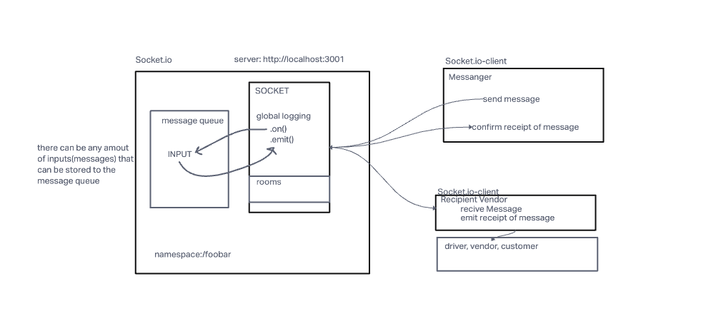

# foobar

System that emulates a real world supply chain
We modeled our project after Uber and Amazon. We wanted to create multiple vendors and queues that could be used

### The following user/developer stories detail the major functionality for this phase of the project

* As a vendor, I want to alert the system when I have a order to be picked up.

* As a driver, I want to be notified when there is a order to be delivered.

* As a driver, I want to alert the system when I have picked up a order and it
  is in transit.

* As a driver, I want to alert the system when a order has been delivered.

* As a vendor, I want to be notified when my order has been delivered.

* As a customer, I want to be notified when my order has been delivered.

* As a customer, I want to be notified when my order has been picked up and it
  is in transit.

### As developers, here are some of the development stories that are relevant to the above

* As a developer, I want to use industry standards for managing the state of each
  package.

* As a developer, I want to create an event driven system so that I can write code that happens in response to events, in real time.

* As a developer, I want to create network event driven system using Socket.io so that I can write code that responds to events originating from both servers and client applications

### UML

